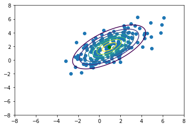
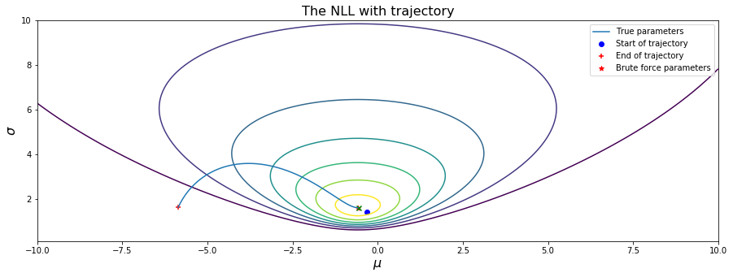
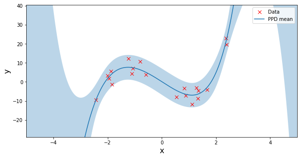

# Probability Theory for Machine Learning (PTML)

This repository contains projects from the Probability Theory for Machine Learning (PTML) Course held at the University of Amsterdam (UvA) in the Fall of 2018.

## Lab 1: Linear Algebra and Probability Fundamentals

The first part of this lab contains exercises related to prerequisite knowledge on Linear Algebra. The second part of the assignment is about probability theory fundamentals, such as the sum- and product rule, and the marginal.

## Lab 2: Estimators: Gaussian Error function

The second lab is about the Gaussian error function.

## Lab 3: Multivariate probability: Gaussian Distribution

The third lab covers topics like the estimating the mean, the covariance matrix and eigenvectors for different data samples from Gaussian distributions.

  

    Plot of vectorized Gaussian.

## Lab 4: Model fitting: Gradient descent and Moment matching

In the first part of the lab the goal is to fit the parameters of a Gaussian, first with gradient descent on the averaged negative log likelihood, and next with Moment matching. In part 2 of this lab is about implementing a gradient descent optimizer to optimize a 1D logistic regressor.

  

    Gaussian negative log likelihood with trajectory.

## Lab 5: Bayesian Inference

The first part of lab 5 is about plotting the prior, posterior and predictive distributions for a set of data assumed to follow an exponential distribution. The second part of the lab plots this for a bayesian linear regression problem.

  

## Lab 6: Model Comparison

In this lab, approximations using linear regression and linear regression with feature transformation are compared and analysed.

--- 

### Acknowledgements

These projects are from the Probability Theory for Machine Learning (PTML) Course, held at the University of Amsterdam in the Fall of 2018.
